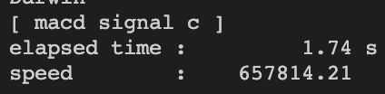

# coin_simulate
코인 데이터 지표 구하는 로직<br>
Index<br>
* [Directory](#directory)
* [Test](#test)
* [Result](#result)

## Directory
```
+- src
    +- C
        +- src : c source
        -- libcalculator.so
        -- Makefile
        -- simulation.py
    +- Python
        -- simulation.py
```

## Test
1. ` pip3 install -r requirements.txt `
### C
1. Move C directorty
2. `make`
3. if test with cProfile uncomment decorator '@profile' above the TestMacd_get_macdsignal function.
4. `python3 -m unittest simulation.TestMacd.test_example`
### python
1. Move Python directory
2. if test with cProfile uncomment decorator '@profile' above the TestMacd_get_macdsignal function.
3. `python3 -m unittest simulation.TestMacd.test_example`
### python multi
1. Move Python 
2. comment decorator '@profile'
3. `python3 -m unittest simulation.TestMacd.test_multiprocess`

## Result
1. C라이브러리를 사용한 mcad signal지표 profiling

2. C라이브러리를 사용한 macd signal지표 구하는 시간은 1.74초.

3. python의 pandas DataFrame을 사용한 macd signal지표 Profiling.

4. python의 single process를 사용한 macd signal지표 구하는 시간은 총 16초.

5. python의 multi process를 사용한 macd signal지표 구하는 시간은 총 14초.
