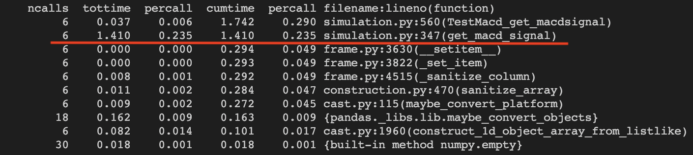
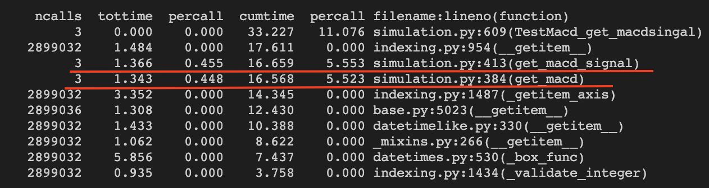
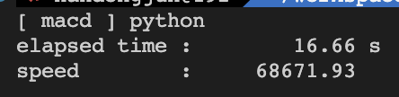
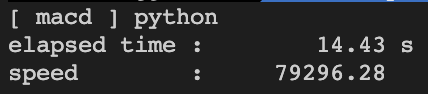

# coin_simulate
코인 데이터 지표 구하는 로직<br>
Index<br>
* [Directory](#directory)
* [Test](#test)
* [Result](#result)

## Directory
```
+- src
    +- C
        +- src : c source
        -- libcalculator.so
        -- Makefile
        -- simulation.py
    +- Python
        -- simulation.py
```

## Test
1. ` pip3 install -r requirements.txt `
### C
1. Move C directorty
2. `make`
3. `python3 -m unittest simulation.TestMacd.test_example`
### python
1. Move Python directory
2. `python3 -m unittest simulation.TestMacd.test_example`
### python multi
1. Move Python directory
2. `python3 simulation.py`

## Result
1. C라이브러리를 사용한 macd signal지표 구하는 시간은 0.23초.

2. python의 pandas DataFrame을 사용한 macd signal지표 구하는 시간은 총 10초.

3. python의 single process를 사용한 macd signal지표 구하는 시간은 총 16초.

4. python의 multi process를 사용한 macd signal지표 구하는 시간은 총 14초.
